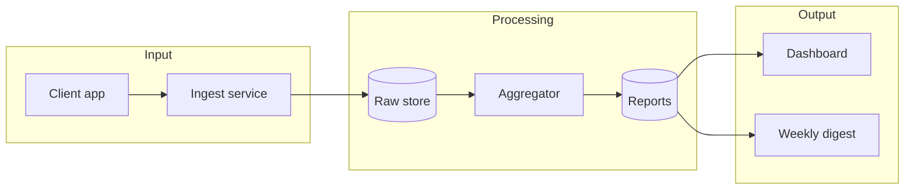

# 🚀 Project · Weekly Sync

### 2026-04-16 → 2026-04-23

---

## What this week means

> Last week we could not answer three questions. Today we can answer two.

Short intro paragraph explaining the arc of the week in one breath.

| 🧱 | 🎯 | 🔁 |
|:-:|:-:|:-:|
| **Foundation in place** | **System sees its errors** | **Loop still to close** |
| short caption | short caption | short caption |

---

## Story №1 — title that carries the point

> 👤 *«user quote that started this»*

Short narrative: what was the problem, what we did, what changed.

**What this means:** one-line outcome in product terms.

---

## Story №2 — another headline

| What broke | How we fixed it |
|------------|-----------------|
| Symptom | One-line fix |
| Symptom | One-line fix |

> [!WARNING]
> Honest caveat block — this is the place to admit what's not done yet.

---

## What we shipped beyond the plan

### Feature A — one-line intent

> *Real example of how it shows up to a user*

### Feature B — one-line intent

Short paragraph.

---

## Backlog — what's next

### 🔥 Hot

| | Item | Why it's hot |
|---|------|--------------|
| 🔥 | Item 1 | reason |
| 🔥 | Item 2 | reason |

### 🟡 Warm

| | Item | What it's waiting on |
|---|------|----------------------|
| 🟡 | Item 3 | reason |

---

## Directions — pick a priority

### 🔁 A · Direction one

> 👤 *dialog anchor*

| | |
|---|---|
| 🎯 **Goal** | what we aim for |
| 🛠 **Ship** | what concretely gets built |
| 🏆 **Wins** | who benefits |
| 💸 **Cost** | time / risk |

### 🚀 B · Direction two

*(same card shape)*

---

## Asks from the team

| Who | Question |
|-----|----------|
| 🎨 Designer | Open question 1 |
| 📊 Analyst | Open question 2 |

---

## Pipeline overview

**Key properties:** *Idempotent* — the aggregator can rerun safely. *Isolated* — processing failures never touch the client path. *Privacy by design* — identifiers are hashed between the raw and public layers.

---

## Agenda · 30 min

| ⏱️ | Block |
|---|-------|
| 5 min | What I did |
| **10 min** | **Main discussion** |
| 5 min | Blocker review |
| 5 min | Next-week plan |
| 5 min | Q&A |

---

*fin · thanks · until next week*

